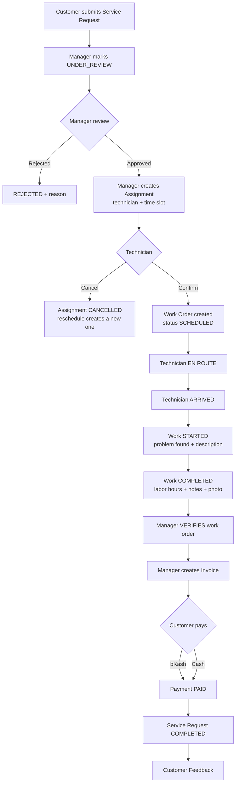
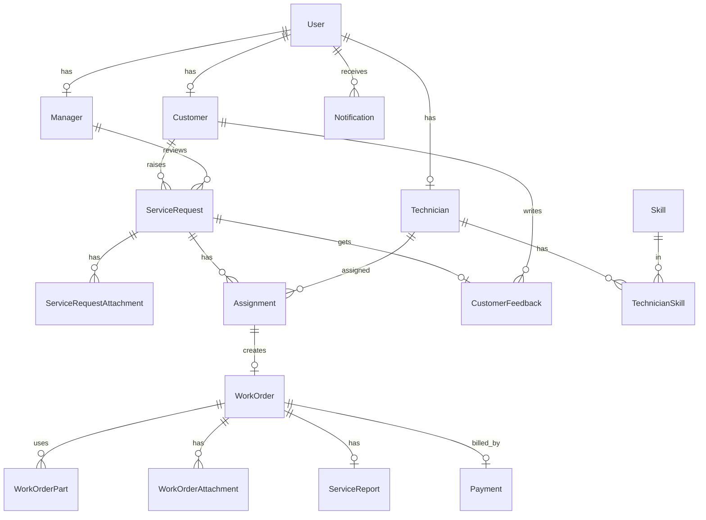

# Field Service Management System — Backend

A REST API backend for managing the full life-cycle of an on-site service business: a customer raises a service request, a manager reviews it and assigns a technician, the technician does the work, and finance issues an invoice that the customer pays (bKash or cash) before leaving feedback.

> **Stack:** Node.js · Express 5 · TypeScript · PostgreSQL · Prisma 7 · Redis · Zod · Cloudinary · Nodemailer · bKash (tokenized checkout)

---

## Table of Contents

1. [Features](#1-features)
2. [User Roles](#2-user-roles)
3. [Workflow](#3-workflow)
4. [State Machines](#4-state-machines)
5. [Tech Stack](#5-tech-stack)
6. [Project Structure](#6-project-structure)
7. [Getting Started](#7-getting-started)
8. [Environment Variables](#8-environment-variables)
9. [NPM Scripts](#9-npm-scripts)
10. [Database Design](#10-database-design)
11. [API Reference](#11-api-reference)
12. [Key Business Rules](#12-key-business-rules)
13. [Payment Flow (bKash)](#13-payment-flow-bkash)
14. [Notifications](#14-notifications)
15. [Known Limitations / TODO](#15-known-limitations--todo)
16. [Security Notes](#16-security-notes)

---

## 1. Features

- **Authentication** — email/password with OTP email verification, Google sign-in, JWT access + refresh tokens (httpOnly cookies or `Bearer` header), forgot / reset password.
- **Customer profiles** and **Technician profiles** (bio, experience, availability, documents, resume).
- **Technician onboarding** — public application form → email OTP → manager approves or rejects.
- **Skills** — skill catalog plus per-technician skills with a level (`BEGINNER`, `INTERMEDIATE`, `EXPERT`).
- **Service requests** — with up to 5 attachments, manager review (under review → approve / reject), customer cancel.
- **Scheduling & assignments** — find available technicians for a time window, assign, confirm, cancel, reschedule, with conflict detection.
- **Work orders** — technician status flow (en route → arrived → started → completed), parts used, photos, service report, manager verification.
- **Invoices & payments** — invoice generated from a verified work order (labor + parts − discount + tax), bKash online payment, cash payment, full refund, PDF invoice download.
- **Notifications** — in-app notifications, email notifications, and a cron job that sends visit reminders.
- **Customer feedback** — rating 1–5 and comment, one per service request.
- **Analytics** — dashboard stats and technician leaderboard / personal stats.

---

## 2. User Roles

| Role          | Description                                                                              |
| ------------- | ---------------------------------------------------------------------------------------- |
| `CUSTOMER`    | Raises service requests, pays invoices, gives feedback.                                  |
| `TECHNICIAN`  | Confirms assignments, runs the work-order flow, writes service reports.                  |
| `MANAGER`     | Reviews requests, assigns technicians, verifies work, creates invoices, handles refunds. |
| `ADMIN`       | Same management permissions as `MANAGER`.                                                |
| `SUPER_ADMIN` | Same management permissions as `MANAGER`; seeded automatically on first start.           |

In the code, "management" means `MANAGER`, `ADMIN`, and `SUPER_ADMIN`.

---

## 3. Workflow



Plain-text version:

```
Customer
   │  POST /service-requests
   ▼
Service Request (PENDING)
   │  Manager: under-review → review (APPROVED / REJECTED)
   ▼
Technician Assignment (PENDING)          ← conflict check on technician's calendar
   │  Technician: confirm
   ▼
Assignment CONFIRMED  ──►  Work Order (SCHEDULED)
   │
   ▼
EN_ROUTE → ARRIVED → IN_PROGRESS → COMPLETED
   │  Manager: verify
   ▼
Work Order VERIFIED
   │  Manager: create invoice
   ▼
Invoice (UNPAID) ──► bKash / Cash ──► PAID  (service request → COMPLETED)
   │
   ▼
Customer Feedback (rating 1-5)
```

---

## 4. State Machines

| Entity                     | Flow                                                                                                                          |
| -------------------------- | ----------------------------------------------------------------------------------------------------------------------------- |
| **ServiceRequest**         | `PENDING` → `UNDER_REVIEW` → `APPROVED` \| `REJECTED`; customer may `CANCELLED`; becomes `COMPLETED` when the invoice is paid |
| **Assignment**             | `PENDING` → `CONFIRMED` \| `CANCELLED` (reschedule cancels the old one and creates a new one)                                 |
| **WorkOrder**              | `SCHEDULED` → `TECHNICIAN_EN_ROUTE` → `ARRIVED` → `IN_PROGRESS` → `COMPLETED` → `VERIFIED` (`CANCELLED` also exists)          |
| **Payment**                | `UNPAID` → `PAID` \| `FAILED`; `PAID` → `REFUNDED`                                                                            |
| **Technician application** | `PENDING` → `APPROVED` \| `REJECTED`                                                                                          |

---

## 5. Tech Stack

| Area               | Technology                                                             |
| ------------------ | ---------------------------------------------------------------------- |
| Runtime / language | Node.js, TypeScript (ESM)                                              |
| Web framework      | Express 5                                                              |
| Database           | PostgreSQL via Prisma ORM 7 (`@prisma/adapter-pg`)                     |
| Cache / OTP store  | Redis                                                                  |
| Validation         | Zod                                                                    |
| Auth               | JWT (`jsonwebtoken`), `bcryptjs`, Google OAuth (`google-auth-library`) |
| File storage       | Cloudinary + Multer                                                    |
| Email              | Nodemailer + EJS templates                                             |
| Payment            | bKash tokenized checkout                                               |
| PDF                | PDFKit (invoice PDF)                                                   |
| Scheduling         | node-cron (visit reminders)                                            |
| Tooling            | tsx, Biome (lint + format)                                             |

---

## 6. Project Structure

```
.
├── prisma/
│   ├── schema/                # multi-file Prisma schema
│   │   ├── schema.prisma      # generator + datasource
│   │   ├── enums.prisma
│   │   ├── user.prisma
│   │   ├── profiles.prisma    # Customer, Technician, Skill, TechnicianSkill, Manager
│   │   ├── service_request.prisma
│   │   ├── assignment.prisma
│   │   ├── work_order.prisma  # WorkOrder, Part, ServiceReport, Attachment
│   │   ├── payment.prisma
│   │   ├── feedback.prisma
│   │   └── notification.prisma
│   └── migrations/
├── prisma.config.ts
└── src/
    ├── server.ts              # boot: DB, Redis, SMTP, seeds, cron
    ├── app.ts                 # express app + route mounting
    ├── generated/prisma/      # generated Prisma client (not committed)
    └── app/
        ├── config/            # env -> typed config
        ├── jobs/              # visitReminder.job.ts (cron)
        ├── lib/               # prisma, redis, cloudinary, nodemailer, bkash, multer, googleAuth
        ├── middleware/        # checkAuth, validateRequest, globalErrorHandler, notFound
        ├── templates/         # EJS email templates
        ├── utils/             # AppError, catchAsync, sendResponse, jwt, seed
        └── module/
            ├── auth/
            ├── user/
            ├── service-request/
            ├── technician/
            ├── skill/
            ├── assignment/
            ├── work-order/
            ├── payment/
            ├── feedback/
            ├── notification/
            └── analytics/
```

Each module follows the same layout: `*.route.ts` → `*.controller.ts` → `*.service.ts`, plus `*.validation.ts` (Zod) and `*.interface.ts` (types).

---

## 7. Getting Started

### Prerequisites

- Node.js 20 or newer
- PostgreSQL (local or hosted)
- A Redis instance (used for OTP storage)
- SMTP account (e.g. a Gmail app password)
- Cloudinary account (file uploads)
- bKash sandbox credentials (only needed for online payment)

### Steps

```bash
# 1. Install dependencies
npm install

# 2. Create your environment file and fill it in (see section 8)
cp .env.example .env

# 3. Generate the Prisma client (output: src/generated/prisma)
npx prisma generate

# 4. Apply database migrations
npx prisma migrate deploy        # or: npx prisma migrate dev   (during development)

# 5. Start the dev server (auto-restarts on change)
npm run dev
```

The server listens on `http://localhost:5000` by default. Open `/` to see the welcome message.

### What happens on startup

`src/server.ts` connects to PostgreSQL, Redis, and the SMTP server (the app exits if any of them fail), then seeds the default accounts (see below) and starts the 10-minute visit-reminder cron job.

### Seeded accounts

On first start these users are created from your `.env` values (if they do not exist yet):

| Role              | Env variables                                                   |
| ----------------- | --------------------------------------------------------------- |
| Super Admin       | `SUPER_ADMIN_NAME`, `SUPER_ADMIN_EMAIL`, `SUPER_ADMIN_PASSWORD` |
| Tester Admin      | `TESTER_ADMIN_*`                                                |
| Tester Manager    | `TESTER_MANAGER_*`                                              |
| Tester Technician | `TESTER_TECHNICIAN_*`                                           |

> Use strong passwords, and remove the tester accounts in production.

### Production build

```bash
npm run build     # compiles to ./dist
npm start         # node dist/src/server.js
```

---

## 8. Environment Variables

Copy `.env.example` to `.env`. **Never commit `.env`, and never put real secrets in `.env.example`.**

| Variable                                                      | Required         | Description                                                                                  |
| ------------------------------------------------------------- | ---------------- | -------------------------------------------------------------------------------------------- |
| `NODE_ENV`                                                    | yes              | `development` or `production`                                                                |
| `PORT`                                                        | yes              | HTTP port (default in example: `5000`)                                                       |
| `DATABASE_URL`                                                | yes              | PostgreSQL connection string                                                                 |
| `JWT_ACCESS_SECRET`                                           | yes              | Secret for access tokens                                                                     |
| `JWT_REFRESH_SECRET`                                          | yes              | Secret for refresh tokens                                                                    |
| `JWT_ACCESS_EXPIRES_IN`                                       | yes              | e.g. `1d`                                                                                    |
| `JWT_REFRESH_EXPIRES_IN`                                      | yes              | e.g. `7d`                                                                                    |
| `BCRYPT_SALT_ROUNDS`                                          | yes              | e.g. `10`                                                                                    |
| `APP_URL`                                                     | yes              | Public URL of this API (e.g. `http://localhost:5000`)                                        |
| `FRONTEND_URL`                                                | yes              | Allowed CORS origin and payment redirect target                                              |
| `GOOGLE_CLIENT_ID`                                            | for Google login | OAuth client id                                                                              |
| `SUPER_ADMIN_NAME` / `_EMAIL` / `_PASSWORD`                   | yes              | Seeded super admin                                                                           |
| `TESTER_ADMIN_NAME` / `_EMAIL` / `_PASSWORD`                  | dev              | Seeded test admin                                                                            |
| `TESTER_MANAGER_NAME` / `_EMAIL` / `_PASSWORD`                | dev              | Seeded test manager                                                                          |
| `TESTER_TECHNICIAN_NAME` / `_EMAIL` / `_PASSWORD`             | dev              | Seeded test technician                                                                       |
| `REDIS_USER` / `REDIS_PASSWORD` / `REDIS_HOST` / `REDIS_PORT` | yes              | Redis connection                                                                             |
| `SMTP_USER` / `SMTP_PASSWORD`                                 | yes              | SMTP login                                                                                   |
| `EMAIL_SENDER`                                                | yes              | "From" address                                                                               |
| `CLOUDINARY_CLOUD_NAME` / `_API_KEY` / `_API_SECRET`          | yes              | File uploads                                                                                 |
| `BKASH_BASE_URL`                                              | for payments     | e.g. `https://tokenized.sandbox.bka.sh/v1.2.0-beta`                                          |
| `BKASH_USERNAME` / `BKASH_PASSWORD`                           | for payments     | bKash merchant credentials                                                                   |
| `BKASH_APP_KEY` / `BKASH_APP_SECRET`                          | for payments     | bKash app credentials                                                                        |
| `BKASH_CALLBACK_URL`                                          | for payments     | **API base URL**, e.g. `http://localhost:5000/api/v1`. The code appends `/payment/callback`. |
| `LABOR_RATE_PER_HOUR`                                         | no               | Labor price per hour used for invoices (default `500`)                                       |
| `TAX_RATE_PERCENT`                                            | no               | Default tax percent for invoices (default `0`)                                               |

---

## 9. NPM Scripts

| Script                                | Command                   | Purpose                        |
| ------------------------------------- | ------------------------- | ------------------------------ |
| `npm run dev`                         | `tsx watch src/server.ts` | Development server with reload |
| `npm run build`                       | `tsc`                     | Compile TypeScript to `dist/`  |
| `npm start`                           | `node dist/src/server.js` | Run the compiled build         |
| `npm run lint:check` / `lint:fix`     | Biome lint                | Check / fix lint problems      |
| `npm run format:check` / `format:fix` | Biome format              | Check / fix formatting         |

Useful Prisma commands:

```bash
npx prisma generate          # regenerate the client after schema changes
npx prisma migrate dev       # create + apply a migration (development)
npx prisma migrate deploy    # apply existing migrations (production)
npx prisma studio            # browse data in the browser
```

---

## 10. Database Design



Design notes:

- `User` holds login data; the role-specific profile lives in `Customer`, `Technician`, or `Manager` (one-to-one).
- A service request can have **many** assignments over time, but only one should be active. Reschedule = cancel the old assignment and create a new one.
- A work order is created when its assignment is **confirmed** (one work order per assignment).
- `Payment` doubles as the invoice (one per work order). Money columns use `Decimal(10,2)`.
- Feedback has no `technicianId`; the technician is derived through `ServiceRequest → Assignment → Technician`.

---

## 11. API Reference

**Base URL:** `/api/v1`

**Authentication:** send the access token either as the `accessToken` cookie (set on login) or in the header `Authorization: Bearer <token>`.

**Response format (success):**

```json
{
  "success": true,
  "statusCode": 200,
  "message": "…",
  "data": {},
  "meta": { "page": 1, "limit": 10, "total": 42, "totalPages": 5 }
}
```

`meta` appears on paginated lists only. "Management" below means `MANAGER`, `ADMIN`, `SUPER_ADMIN`.

### Auth — `/auth`

| Method | Path               | Access             | Description                           |
| ------ | ------------------ | ------------------ | ------------------------------------- |
| POST   | `/register`        | Public             | Register a customer (sends OTP email) |
| POST   | `/verify-email`    | Public             | Verify the 6-digit OTP                |
| POST   | `/login`           | Public             | Email + password login                |
| POST   | `/google`          | Public             | Login with a Google ID token          |
| POST   | `/refresh-token`   | Public             | Get a new access token                |
| GET    | `/me`              | Any logged-in user | Current user                          |
| POST   | `/forgot-password` | Public             | Send reset OTP                        |
| POST   | `/reset-password`  | Public             | Reset password with OTP               |

### User — `/user`

| Method | Path             | Access             | Description                                  |
| ------ | ---------------- | ------------------ | -------------------------------------------- |
| PATCH  | `/profile-image` | Any logged-in user | Upload profile image (field: `profileImage`) |

### Service Requests — `/service-requests`

| Method | Path                              | Access                           | Description                                                   |
| ------ | --------------------------------- | -------------------------------- | ------------------------------------------------------------- |
| POST   | `/`                               | Customer                         | Create request (multipart, field `attachments`, max 5)        |
| GET    | `/my-requests`                    | Customer                         | My requests                                                   |
| PATCH  | `/:serviceRequestId/cancel`       | Customer                         | Cancel my request                                             |
| GET    | `/`                               | Management                       | All requests                                                  |
| PATCH  | `/:serviceRequestId/under-review` | Management                       | `PENDING` → `UNDER_REVIEW`                                    |
| PATCH  | `/:serviceRequestId/review`       | Management                       | Approve or reject (`rejectionReason` required when rejecting) |
| GET    | `/:serviceRequestId`              | Customer, Technician, Management | Single request                                                |

### Technicians — `/technicians`

| Method | Path                    | Access     | Description                                                       |
| ------ | ----------------------- | ---------- | ----------------------------------------------------------------- |
| POST   | `/apply`                | Public     | Apply as technician (multipart: resume + documents + JSON `data`) |
| POST   | `/apply/verify-email`   | Public     | Verify application OTP                                            |
| POST   | `/apply/resend-otp`     | Public     | Resend application OTP                                            |
| GET    | `/my-profile`           | Technician | Own profile                                                       |
| PATCH  | `/my-profile`           | Technician | Update own profile                                                |
| PATCH  | `/my-availability`      | Technician | Toggle availability                                               |
| POST   | `/my-skills`            | Technician | Add a skill                                                       |
| DELETE | `/my-skills/:skillId`   | Technician | Remove a skill                                                    |
| GET    | `/`                     | Management | List technicians                                                  |
| GET    | `/:technicianId`        | Management | Single technician                                                 |
| PATCH  | `/:technicianId/review` | Management | Approve / reject application                                      |

### Skills — `/skills`

| Method | Path        | Access     | Description  |
| ------ | ----------- | ---------- | ------------ |
| GET    | `/`         | Public     | List skills  |
| POST   | `/`         | Management | Create skill |
| PATCH  | `/:skillId` | Management | Update skill |
| DELETE | `/:skillId` | Management | Delete skill |

### Assignments — `/assignments`

| Method | Path                                                            | Access                 | Description                                         |
| ------ | --------------------------------------------------------------- | ---------------------- | --------------------------------------------------- |
| GET    | `/my-assignments`                                               | Technician             | My assignments                                      |
| GET    | `/available-technicians?scheduledStart=&scheduledEnd=&skillId=` | Management             | Approved, available technicians free in that window |
| POST   | `/`                                                             | Management             | Assign technician + schedule visit                  |
| GET    | `/`                                                             | Management             | All assignments                                     |
| PATCH  | `/:assignmentId/reschedule`                                     | Management             | Cancel old, create new assignment                   |
| PATCH  | `/:assignmentId/confirm`                                        | Technician             | Confirm (creates the work order)                    |
| PATCH  | `/:assignmentId/cancel`                                         | Technician, Management | Cancel with a reason                                |
| GET    | `/:assignmentId`                                                | Technician, Management | Single assignment                                   |

### Work Orders — `/work-orders`

| Method | Path                                      | Access                           | Description                                                                            |
| ------ | ----------------------------------------- | -------------------------------- | -------------------------------------------------------------------------------------- |
| GET    | `/my-work-orders`                         | Technician                       | My work orders                                                                         |
| GET    | `/`                                       | Management                       | All work orders                                                                        |
| GET    | `/service-request/:serviceRequestId`      | Customer, Technician, Management | Work orders of a request                                                               |
| PATCH  | `/:workOrderId/en-route`                  | Technician                       | `SCHEDULED` → `TECHNICIAN_EN_ROUTE`                                                    |
| PATCH  | `/:workOrderId/arrived`                   | Technician                       | → `ARRIVED`                                                                            |
| PATCH  | `/:workOrderId/start`                     | Technician                       | → `IN_PROGRESS` (body: `problemFound`, `workDescription`)                              |
| PATCH  | `/:workOrderId/complete`                  | Technician                       | → `COMPLETED` (multipart: `laborHours`, `completionNotes`, optional `completionImage`) |
| POST   | `/:workOrderId/parts`                     | Technician                       | Add a part (`name`, `quantity`, `unitCost`)                                            |
| DELETE | `/:workOrderId/parts/:partId`             | Technician                       | Remove a part                                                                          |
| POST   | `/:workOrderId/attachments`               | Technician                       | Upload photos (field `attachments`, max 5)                                             |
| DELETE | `/:workOrderId/attachments/:attachmentId` | Technician                       | Remove an attachment                                                                   |
| PUT    | `/:workOrderId/service-report`            | Technician                       | Create / update service report                                                         |
| PATCH  | `/:workOrderId/verify`                    | Management                       | `COMPLETED` → `VERIFIED`                                                               |
| GET    | `/:workOrderId`                           | Customer, Technician, Management | Single work order (customers and technicians see only their own)                       |

### Payments & Invoices — `/payment`

| Method | Path                                       | Access                     | Description                                 |
| ------ | ------------------------------------------ | -------------------------- | ------------------------------------------- |
| GET    | `/my-invoices`                             | Customer                   | My invoices                                 |
| POST   | `/initiate`                                | Customer                   | Start bKash payment (body: `paymentId`)     |
| GET    | `/callback`                                | bKash (public)             | Gateway callback; redirects to the frontend |
| POST   | `/invoices`                                | Management                 | Create invoice from a verified work order   |
| GET    | `/invoices?status=&from=&to=&page=&limit=` | Management                 | List invoices                               |
| PATCH  | `/invoices/:paymentId/cash`                | Management                 | Mark paid in cash                           |
| PATCH  | `/invoices/:paymentId/refund`              | Management                 | Full refund                                 |
| GET    | `/invoices/:paymentId/pdf`                 | Customer (own), Management | Download invoice PDF                        |
| GET    | `/invoices/:paymentId`                     | Customer (own), Management | Single invoice                              |

### Feedback — `/feedbacks`

| Method | Path                                   | Access                           | Description                                               |
| ------ | -------------------------------------- | -------------------------------- | --------------------------------------------------------- |
| POST   | `/`                                    | Customer                         | Create feedback (`serviceRequestId`, `rating`, `comment`) |
| GET    | `/my-feedbacks`                        | Customer                         | My feedbacks                                              |
| GET    | `/technician/my-feedbacks`             | Technician                       | Feedback about me                                         |
| GET    | `/technician/:technicianId`            | Management                       | Feedback of a technician                                  |
| GET    | `/service-request/:serviceRequestId`   | Customer, Technician, Management | Feedback of a request                                     |
| GET    | `/?rating=&technicianId=&page=&limit=` | Management                       | All feedbacks                                             |
| PATCH  | `/:feedbackId`                         | Customer                         | Edit my feedback                                          |
| DELETE | `/:feedbackId`                         | Customer, Management             | Delete feedback                                           |

### Notifications — `/notifications`

| Method | Path                    | Access             | Description               |
| ------ | ----------------------- | ------------------ | ------------------------- |
| GET    | `/`                     | Any logged-in user | My notifications          |
| GET    | `/unread-count`         | Any logged-in user | Unread badge count        |
| PATCH  | `/read-all`             | Any logged-in user | Mark all as read          |
| DELETE | `/clear-read`           | Any logged-in user | Delete read notifications |
| PATCH  | `/:notificationId/read` | Any logged-in user | Mark one as read          |
| DELETE | `/:notificationId`      | Any logged-in user | Delete one                |

### Analytics — `/analytics`

| Method | Path                                         | Access     | Description             |
| ------ | -------------------------------------------- | ---------- | ----------------------- |
| GET    | `/dashboard`                                 | Management | Overall dashboard stats |
| GET    | `/technicians?sortBy=averageRating&limit=10` | Management | Technician leaderboard  |
| GET    | `/technicians/me`                            | Technician | My own stats            |
| GET    | `/technicians/:technicianId`                 | Management | Stats of one technician |

---

## 12. Key Business Rules

**Scheduling**

- Only a service request in `APPROVED` status can be assigned.
- Only a technician who is verification-`APPROVED` **and** available (`isAvailable = true`) can be assigned.
- Two visits overlap when `existing.start < newEnd` **and** `existing.end > newStart`. Back-to-back slots (10:00–12:00 and 12:00–14:00) do **not** conflict. Only `PENDING` and `CONFIRMED` assignments count.
- `scheduledEnd` must be after `scheduledStart`.

**Work orders**

- A work order is created automatically when the technician confirms the assignment.
- Status can only move forward through the flow in [section 4](#4-state-machines).
- Completion requires `laborHours` (> 0, max 100) and `completionNotes`.

**Invoicing**

- An invoice can only be created for a work order in `VERIFIED` status that has labor hours, and only once per work order.
- Calculation:
  ```
  subtotal    = Σ(part.totalCost) + laborHours × LABOR_RATE_PER_HOUR
  taxAmount   = (subtotal − discount) × taxPercent / 100
  totalAmount = subtotal − discount + taxAmount
  ```
- `discount` cannot exceed the subtotal, and the total must be greater than 0.
- The amount sent to the payment gateway always comes from the database, never from the request.

**Refunds**

- Only `PAID` invoices can be refunded (full refund). For bKash payments the bKash refund API is called first.

**Feedback**

- Allowed only for your own service request, only after it is completed and paid, and only once per request. Rating is a whole number from 1 to 5.

**Passwords**

- At least 8 characters with a lowercase letter, an uppercase letter, a number, and a special character.

---

## 13. Payment Flow (bKash)

```
Customer app                API                       bKash
     │  POST /payment/initiate   │                        │
     │  { paymentId }            │── create payment ─────►│
     │                           │◄── paymentID + URL ────│
     │◄── redirect URL ──────────│                        │
     │── customer pays on bKash ─┼───────────────────────►│
     │                           │◄── GET /payment/callback
     │                           │── execute / verify ───►│
     │                           │   (DB transaction: Payment=PAID,
     │                           │    ServiceRequest=COMPLETED)
     │◄── redirect to FRONTEND_URL/dashboard/payments?status=… ──│
```

- `BKASH_CALLBACK_URL` must be reachable from bKash (use a tunnel such as ngrok when developing locally).
- Cash payments are recorded by management via `PATCH /payment/invoices/:paymentId/cash`.

---

## 14. Notifications

Every important event creates an in-app notification and (where relevant) an email, for example: request created / approved / rejected, assignment created / confirmed / cancelled / rescheduled, technician en route / arrived, work started / completed / verified, invoice created, payment received / refunded, feedback received, technician application submitted / reviewed.

A cron job (`src/app/jobs/visitReminder.job.ts`) runs **every 10 minutes** and sends a reminder for `CONFIRMED` visits starting within the next 60 minutes (duplicates are prevented inside the notification event).

---

## 15. Known Limitations / TODO

- [x] **Database-level overlap protection** — added in migration `20261003120000_assignment_overlap_constraints` (`no_technician_overlap` exclusion constraint + `one_active_assignment_per_request` partial unique index). Run `npx prisma migrate deploy` to apply it.
- [ ] Migration history has two folders both named `init`; verify with `npx prisma migrate reset` on an empty database.
- [ ] No automated tests yet.
- [ ] No rate limiting or `helmet`; add them to login and OTP endpoints before going live.
- [ ] Invoices have no line items (one invoice per work order, totals only).
- [ ] API documentation is this README only; a Swagger / Postman collection would help.

---

## 16. Security Notes

- Keep `.env` out of version control. If any secret was ever committed (database URL, Redis password, SMTP app password, Cloudinary secret, JWT secrets), **rotate it immediately**; deleting the file is not enough because it stays in git history.
- Use long random values for `JWT_ACCESS_SECRET` and `JWT_REFRESH_SECRET`.
- Change or remove the seeded tester accounts outside development.
- Serve the API over HTTPS in production and set `FRONTEND_URL` to your exact frontend origin (CORS uses it with credentials).

---

## License

ISC
